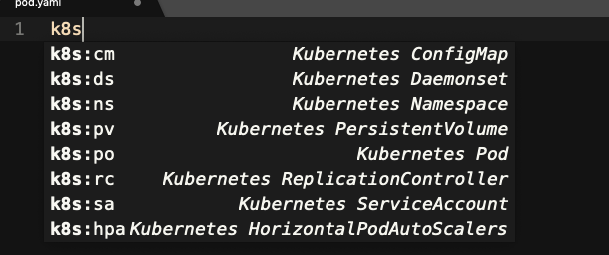

# Kubernetes Snippets for Sublime Text

# 如何使用

```bash
```
拷贝sublime-kubernetes-snippets到Sublime Packages/User目录。


How to enable the Kubernetes Snippets


Clone the repor and copy the files into  ~/Library/Application\ Support/Sublime\ Text\ 3/Packages/User/ diretory.
```
$ git clone https://github.com/songjiz/sublime-kubernetes-snippets
$ cd sublime-kubernetes-snippets
$ cp Kubernetes* ~/Library/Application\ Support/Sublime\ Text\ 3/Packages/User/
```

Create a file in Sublime Text with `yaml` extension. If you don't create the file with .yaml extension, you will not able to use snippets.
and start typing k8s to see the list of the snippets
```</content>
  <tabTrigger>k8s:role</tabTrigger>
  <scope>source.yaml</scope>
  <description>Kubernetes Role</description>
</snippet>
````
Using 

