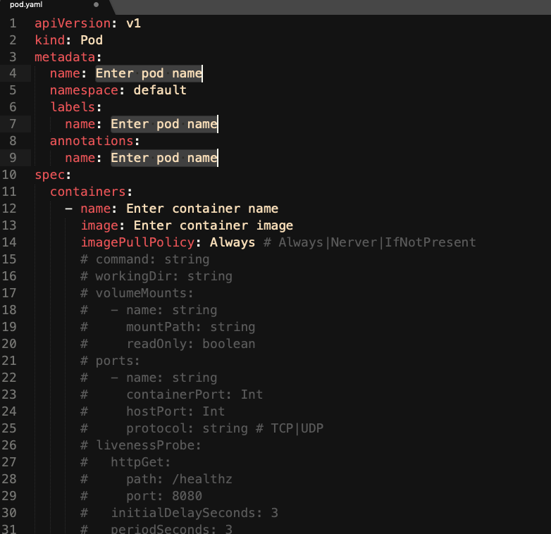

# Kubernetes Snippets for Sublime Text

## Sublime Packages/User


## How to enable the Kubernetes Snippets

Clone the repo and copy the files into  ~/Library/Application\ Support/Sublime\ Text\ 3/Packages/User/ diretory.
```
$ git clone https://github.com/songjiz/sublime-kubernetes-snippets
$ cd sublime-kubernetes-snippets
$ cp Kubernetes* ~/Library/Application\ Support/Sublime\ Text\ 3/Packages/User/
```

## Using Snippets in Sublime Text

Create a file in Sublime Text with `yaml` extension. If you don't create the file with .yaml extension, you will not able to use snippets.
and start typing k8s to see the list of the snippets


If you select k8s:po Kubernetes Pod, you will get the Pod yaml


